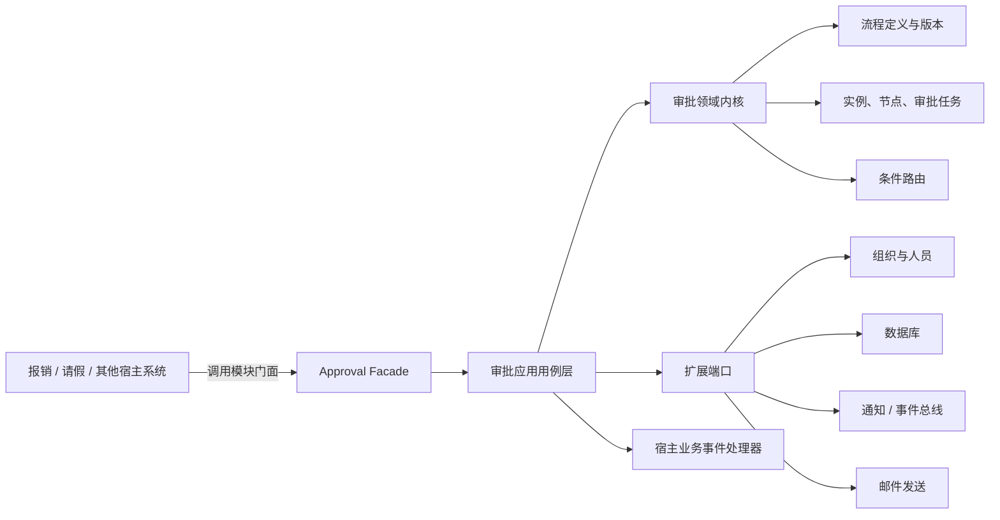
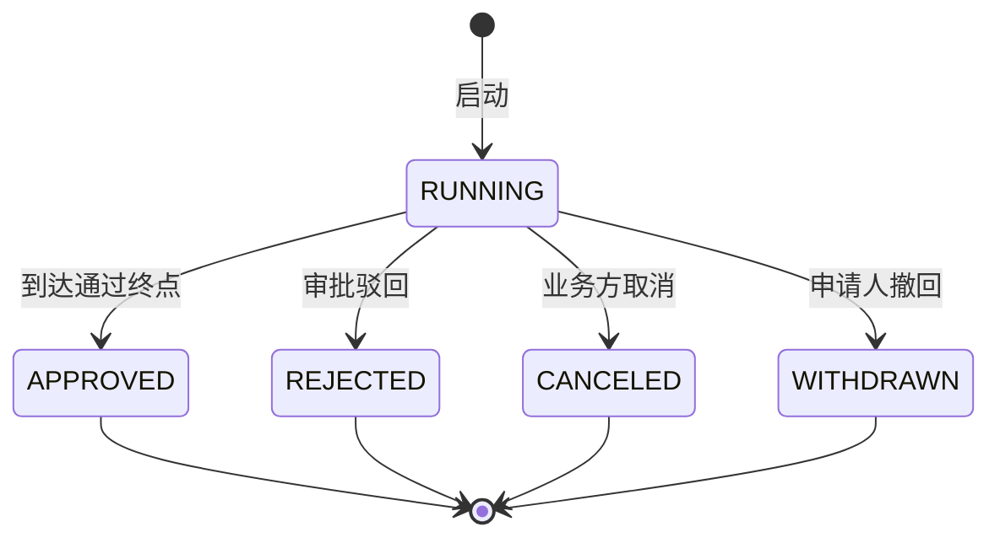

# 通用审批流设计草案

## 1. 目标与边界

审批引擎只负责“谁在什么条件下审批、审批进行到哪里、结果是什么”，不负责报销金额计算、请假余额扣减等具体业务。

业务系统通过统一的模块门面接入；需要提供 HTTP 接口时，由宿主系统将门面包装成自己的接口：

- 提交一个业务对象引用，例如 `expense/EXP-2026-001`；
- 指定要使用的流程定义，例如 `expense-approval`；
- 传入本次审批需要的上下文快照，例如金额、部门、请假天数；
- 订阅审批完成、驳回等领域事件，再完成入账、扣假等业务动作。

首期建议明确不做 BPMN 全集、自由脚本执行和可视化设计器。先完成稳定、可扩展的审批内核，再在同一份流程契约上增加设计器。

## 2. 已确认架构

采用“审批内核 + 宿主适配器”的嵌入式结构，不单独部署审批服务。核心领域层不依赖 Web 框架、ORM、邮件供应商和组织系统；每个宿主系统安装相同版本的软件包，并将审批表保存在自己的数据库中。



### 模块职责

| 模块 | 职责 | 不应承担 |
| --- | --- | --- |
| `definition` | 草稿、校验、发布、版本管理 | 运行时状态 |
| `runtime` | 启动实例、推进节点、生成任务 | 业务单据规则 |
| `task` | 审批、驳回、转交、加签等动作 | 流程图解析 |
| `routing` | 基于结构化条件选择下一条边 | 执行任意代码 |
| `identity` | 解析用户、角色、部门、上级 | 保存业务系统组织架构副本 |
| `integration` | 模块门面、事件、邮件、幂等 | 修改领域状态规则 |
| `audit` | 不可变操作记录、追踪信息 | 代替业务日志 |

## 3. 核心领域模型

### 流程定义

- `WorkflowDefinition`：流程逻辑名称，例如 `expense-approval`。
- `WorkflowVersion`：已发布版本不可修改，新规则必须发布新版本。
- `Node`：首期支持 `START`、`APPROVAL`、`CONDITION`、`END`。
- `Edge`：节点连线，可带结构化条件、优先级或默认分支。
- `AssigneePolicy`：审批人解析策略，例如指定用户、角色、部门角色、申请人上级或外部解析器。

发布时必须做语义校验：

- 恰好一个开始节点，至少一个结束节点；
- 节点 ID 唯一，连线引用存在；
- 所有非结束节点都可继续流转；
- 条件节点最多一条默认分支，条件优先级不得冲突；
- 首期流程必须是有向无环图；
- 审批节点必须能解析审批人，并明确“无人可审”策略。

### 运行时对象

- `WorkflowInstance`：一次业务审批，固定引用启动时的流程版本和上下文快照。
- `NodeExecution`：某节点的一次执行记录；具有独立执行 ID、轮次和前序执行引用，退回与重新提交通过新轮次执行追加历史。
- `ApprovalTask`：分配给具体审批人的待办。
- `ApprovalAction`：同意、驳回、撤销、转交等不可变操作记录。
- `TransitionHistory`：记录每次节点跳转，不把实例建模为只有一个可覆盖的“当前节点”。
- `OutboxEvent`：与状态变更同事务保存、异步可靠投递的事件。

### 建议状态



任务状态建议为：`PENDING`、`APPROVED`、`REJECTED`、`CANCELED`、`SKIPPED`、`TRANSFERRED`。所有状态变化都必须经过领域命令，不允许直接更新数据库状态。

## 4. 可插拔扩展点

内核通过端口依赖外部能力，接入新业务时通常只需要配置流程和实现必要适配器。

```text
AssigneeResolver       根据策略解析审批人
OrganizationProvider   查询角色、部门、上下级关系
WorkflowRepository     保存流程定义及发布版本
RuntimeRepository      保存实例、节点执行和任务
EventPublisher         发布审批领域事件
NotificationPort       发送站内信、邮件或企业 IM 通知
UserContactProvider    从统一组织架构获得姓名和邮箱
Clock / IdGenerator    提供可测试的时间与 ID
```

扩展规则应遵守：

- 条件使用白名单字段和结构化操作符，不直接执行 JavaScript、SpEL 或 Python；
- 业务上下文在启动时保存快照，保证历史审批可重放和审计；
- 自定义审批人逻辑通过命名的 `PROVIDER` 插件注册，不把类名或 URL 写进流程；
- 通知和业务回调是事件消费者，失败不能回滚已经成功的审批动作；
- 所有外部调用必须有超时、重试上限和可追踪 ID。
- SMTP 地址、账号和凭据由宿主系统注入，审批内核不读取或保存这些配置。

## 5. 统一模块门面

### 启动审批

```json
{
  "idempotencyKey": "expense:EXP-2026-001:submit:1",
  "definitionKey": "expense-approval",
  "business": {
    "type": "expense",
    "id": "EXP-2026-001",
    "url": "/expenses/EXP-2026-001"
  },
  "applicantId": "user-1001",
  "context": {
    "amount": 6800,
    "currency": "CNY",
    "departmentId": "sales"
  }
}
```

调用形式为 `approval.start(command)`。系统返回实例 ID、锁定的流程版本和当前状态。相同宿主、幂等键和请求摘要只能产生一个实例。

### 处理任务

```json
{
  "taskId": "T-10001",
  "idempotencyKey": "task:T-10001:approve:request-123",
  "action": "APPROVE",
  "operatorId": "user-2001",
  "comment": "同意"
}
```

调用形式为 `approval.act(command)`。模块必须校验任务仍为待办、操作者有权处理、版本号未冲突。使用宿主数据库事务和乐观锁防止重复审批。

### 驳回重提与退回

`action` 除 `APPROVE` / `REJECT` 外支持两个非终止动作：

- `REJECT_TO_APPLICANT`：退回申请人。当前节点执行以 `REJECTED` 结束，其余待办取消，流程在 START 节点开启新的轮次执行（`round + 1`），实例保持 `RUNNING`，等待申请人修改后重新提交；
- `RETURN_TO_NODE`：退回指定已到过的审批节点。目标节点同样开启新轮次并重新解析审批人，实例保持 `RUNNING`。

申请人通过 `approval.updateContext(command)` 重新提交：仅允许申请人在“已退回申请人”状态调用，可替换业务上下文并使 `contextRevision` 递增，之后流程带着新上下文从 START 重新前进，条件节点按新上下文重新路由。

两类退回都写入 `type = "RETURN"` 的轨迹，重新提交写入 `type = "RESUBMIT"` 的轨迹；`REJECT` 仍是终止动作，实例进入 `REJECTED`。

### 撤回与取消

- `approval.withdraw(command)`：申请人撤回误提交的单据。仅申请人本人、仅 `RUNNING` 实例可调用；默认在有审批任务已被同意后禁止撤回，可通过 `policies.withdrawalPolicy.allowAfterTaskCompleted` 放开。已被退回申请人（尚未有人同意）时仍允许撤回；
- `approval.cancel(command)`：宿主完成权限判断后调用，用于管理员作废流程，同样仅作用于 `RUNNING` 实例，可携带 `reason` 进入审计事件。

两者都会取消全部待办、结束当前节点执行并产生 `approval.instance.withdrawn` / `approval.instance.canceled` 事件。

### 领域事件

首期建议至少发布：

- `approval.instance.started`
- `approval.task.created`
- `approval.task.completed`
- `approval.instance.approved`
- `approval.instance.rejected`
- `approval.instance.canceled`
- `approval.instance.returned`
- `approval.instance.resubmitted`
- `approval.instance.withdrawn`

每个事件都包含 `eventId`、`instanceId`、业务对象引用、发生时间和事件版本。宿主消费者按 `eventId` 幂等处理。

### 邮件通知

首期默认支持以下邮件：

- 创建审批任务时通知审批人；
- 审批通过、驳回或取消时通知申请人；
- 邮件正文包含业务类型、业务编号、当前节点、发起人和宿主系统提供的详情链接。

审批事务只写入通知 Outbox，不在事务中直接连接 SMTP。宿主后台任务提交事务后异步发送，失败按配置退避重试，超过上限进入失败队列并记录原因。邮件模板由 `templateKey` 引用，允许宿主覆盖默认模板。

## 6. 数据持久化建议

关系数据库即可满足首期要求，核心表建议为：

| 表 | 关键内容 |
| --- | --- |
| `workflow_definitions` | 流程 key、名称、当前状态 |
| `workflow_versions` | 版本号、不可变定义 JSON、发布时间 |
| `workflow_instances` | 业务引用、版本、申请人、上下文快照、状态、版本号 |
| `node_executions` | 节点、进入/离开时间、执行结果 |
| `approval_tasks` | 审批人、状态、处理时间、乐观锁版本 |
| `approval_actions` | 操作者、动作、意见、前后状态、追踪 ID |
| `transition_history` | 前后节点执行、迁移类型、发生时间 |
| `outbox_events` | 事件体、投递状态、重试次数 |
| `idempotency_records` | 调用方、幂等键、请求摘要、响应摘要 |

关键唯一约束建议包括：

- `(definition_key)`；
- `(definition_id, version)`；
- `(business_type, business_id, active_flag)`，是否允许同一业务对象多次发起需配置；
- `(idempotency_key)`；
- 任务动作的业务幂等键。

## 7. 第一阶段能力范围

当前已实现：

- 顺序流程和条件分支；
- 指定用户、角色、部门角色、申请人上级四种审批人策略；
- 或签 `ANY` 与会签 `ALL`；
- 同意、驳回；
- 流程定义草稿、校验、发布和版本锁定；
- 待办查询、审批轨迹和动作记录；
- 幂等、乐观锁、事务 Outbox；
- 业务完成事件和通知扩展端口；
- 审批任务及最终结果的异步邮件通知。
- Supabase Data API 与 Direct PostgreSQL 两种持久化入口。

尚未实现，建议后续加入：

- 申请人撤回、业务方取消；
- 依次会签、加签、转交、委托；
- 退回到任意节点和重新提交；
- 超时、催办、自动审批；
- 并行网关、子流程；
- 图形化流程设计器和流程仿真。

## 8. 推荐工程边界

选择具体语言后，可以按下面的边界落地；目录名可遵循所选框架调整。

```text
approval-module/
  domain/
    definition/       # 定义、节点、连线、发布校验
    runtime/          # 实例推进与状态机
    task/             # 审批任务和动作规则
    events/           # 领域事件
  application/
    commands/         # 启动、审批、驳回、撤回、取消
    queries/          # 实例、待办、历史查询
    ports/            # 仓储、组织、通知、事件端口
  adapters/
    host/             # 宿主框架装配、鉴权上下文、输入校验
    persistence/      # 数据库实现
    identity/         # 组织与人员系统实现
    messaging/        # Outbox 发布、邮件与通知实现
  contracts/          # API DTO、事件、流程定义 Schema
  tests/
    domain/
    application/
    integration/
```

## 9. 已确认的产品决策

1. 面向多个系统复用，但以软件包形式嵌入，不独立部署。
2. 首期不实现退回和重提，但运行记录按多轮执行建模，避免未来推翻数据结构。
3. 审批人从公司统一组织架构解析。
4. 审批节点可配置 `ANY` 或 `ALL`；首期不实现比例和权重。
5. 已运行实例锁定发布时的流程版本，不随新版本迁移。
6. 首期不做多租户、电子签名和额外合规能力，但保留完整审计记录。
7. 首期提供异步邮件通知能力。

宿主边界已确定为 TypeScript/Node.js。Next.js App Router、NestJS 或其他 Node.js 后端均通过同一核心契约装配；非 Node.js 系统不能直接加载该包，需要语言适配或重新评估独立进程方案。

数据库边界已确定为同 Schema 双通道：测试和联调可通过 Supabase 服务端 Data API，正式环境可直连 PostgreSQL。具体见 [持久化与部署说明](persistence-and-deployment.md)。
