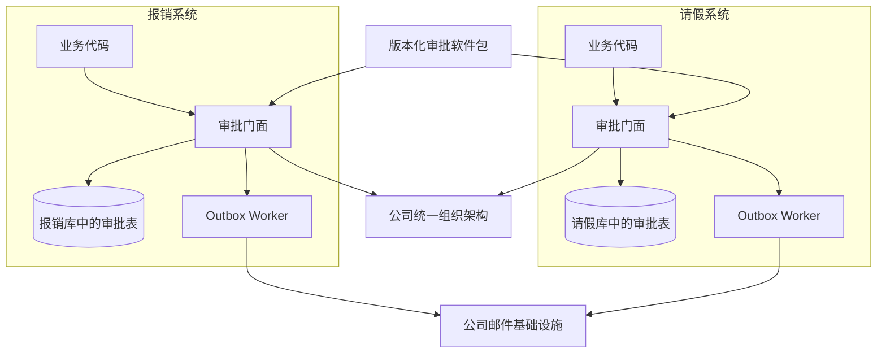
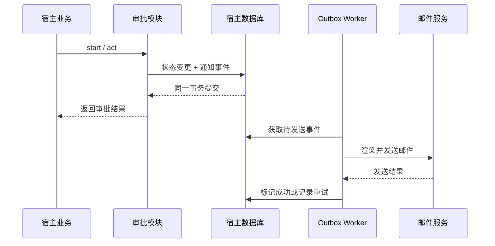

# 嵌入式审批模块架构

## 1. 可行性结论

多个系统复用、但不部署独立审批服务是可行的，前提是明确复用边界：复用的是审批内核、流程契约和默认适配器，不是让多个系统共同操作一个审批进程。

每个宿主系统拥有自己的：

- 审批实例和审批任务数据；
- 审批模块事务；
- 流程配置和发布版本；
- 邮件 Outbox 与发送任务；
- 宿主业务事件处理器。

所有宿主系统共同依赖公司组织架构，但通过统一接口访问，不把组织数据复制进审批模块。



## 2. 建议的软件包组成

```text
approval-core             纯领域模型、流程推进、条件判断
approval-application      start / act / cancel / query 等用例门面
approval-contracts        流程 Schema、命令、结果、事件契约
approval-persistence-*    默认数据库实现及版本化迁移
approval-organization-*   公司组织架构适配器
approval-email-*          邮件 Outbox、模板与发送适配器
approval-host-*           Spring Boot Starter、Nest Module 等宿主装配包
```

宿主只面对一个稳定门面：

```text
ApprovalFacade
  start(StartApprovalCommand) -> ApprovalInstance
  act(ActOnTaskCommand) -> ActionResult
  updateContext(UpdateContextCommand) -> ApprovalInstance
  withdraw(WithdrawCommand) -> ApprovalInstance
  cancel(CancelApprovalCommand) -> ApprovalInstance
  getInstance(instanceId) -> ApprovalInstanceView
  getInstanceByBusiness(type, id, status?) -> ApprovalInstanceView
  queryTasks(query) -> Page<ApprovalTaskView>
  listTasks(query) -> Page<ApprovalTaskView>
```

认证用户不应由调用方在普通请求体中任意指定。宿主适配器从当前登录上下文获得操作者，再传给应用层。

## 3. 宿主装配契约

```text
ApprovalModule.configure({
  transactionManager,
  workflowRepository,
  runtimeRepository,
  organizationProvider,
  userContactProvider,
  eventOutbox,
  emailSender,
  templateRenderer,
  clock,
  idGenerator
})
```

为降低接入成本，软件包提供 Supabase Data API、Direct PostgreSQL、Outbox 和邮件模板的默认实现；接口仍保留，允许特殊宿主替换。Direct PostgreSQL 可以接收宿主已有客户端，也提供显式创建并由宿主关闭的连接池工厂。审批模块不会自行启动后台线程或读取宿主私有配置。

## 4. 多系统嵌入需要控制的风险

| 风险 | 处理方式 |
| --- | --- |
| 宿主使用不同语言 | 同语言直接发包；不同语言需要适配包，成本显著增加 |
| 各系统模块版本漂移 | 使用语义化版本、兼容矩阵和升级说明 |
| 数据库结构不一致 | 迁移脚本随持久化适配包发布，并记录 schema 版本 |
| 组织架构接口波动 | 只依赖稳定的 `OrganizationProvider`，缓存需有失效策略 |
| 邮件失败影响审批 | 审批事务写 Outbox，提交后异步发送 |
| 宿主绕过领域规则 | 数据写入仅通过 `ApprovalFacade`，仓储实现不作为公共 API |
| 流程定义跨系统不一致 | Schema 版本化；公共流程可打成独立配置包 |

不要让多个嵌入式宿主直接共享并写入同一组审批表。这会让事务归属、版本兼容和故障边界变得不清晰。如果未来要求跨系统统一待办和统一审批历史，应增加只读聚合层，或再评估独立审批服务。

## 5. 退回和重提的结构

退回通过运行时命令实现，流程图本身仍不允许回边，历史记录按以下规则追加：

- 每次进入节点都创建新的 `NodeExecution`，不覆盖旧记录；
- `NodeExecution` 包含 `executionId`、`round`、`previousExecutionId`；
- `ApprovalTask` 关联具体 `executionId`，旧任务关闭后不复用；
- 所有跳转写入 `TransitionHistory`；
- 业务上下文保存 `revision`，重提时追加新快照而非覆盖旧快照；
- 数据库中的动作和状态使用可扩展字符串字段，具体允许值由领域层校验。

已实现的退回链路：

```text
REJECT_TO_APPLICANT -> START 节点新轮次执行，等待申请人 updateContext 重新提交
RETURN_TO_NODE      -> 指定已到过的审批节点新轮次执行，重新解析审批人
updateContext       -> contextRevision + 1，从 START 带新上下文重新前进（RESUBMIT 轨迹）
```

流程图中不引入回边，避免校验器复杂化；多轮流转完全由执行历史表达。

## 6. 会签规则

每个审批节点通过 `mode` 配置：

- `ANY`：任意一名审批人同意即通过，其余待办自动关闭；任一人驳回则节点驳回。
- `ALL`：所有审批人同意才通过；任一人驳回则节点立即驳回，其余待办自动关闭。

节点生成任务时必须保存解析后的审批人快照。组织架构后续发生变化，不应悄悄改变已经创建的待办。

比例、权重和依次审批首期不实现。未来如有需要，可将判断封装为 `ApprovalCompletionPolicy`，在不修改任务模型的情况下增加策略。

## 7. 邮件通知链路



邮件发送至少需要三个端口：

- `UserContactProvider`：根据用户 ID 获取姓名和邮箱；
- `TemplateRenderer`：根据模板 key、语言和事件数据渲染主题及正文；
- `EmailSender`：对接 SMTP、企业邮件 API 或云邮件服务。

默认通知策略为“新待办通知审批人，最终结果通知申请人”。后续可以增加流程级通知策略，但不应把 SMTP 凭据写入流程定义。
